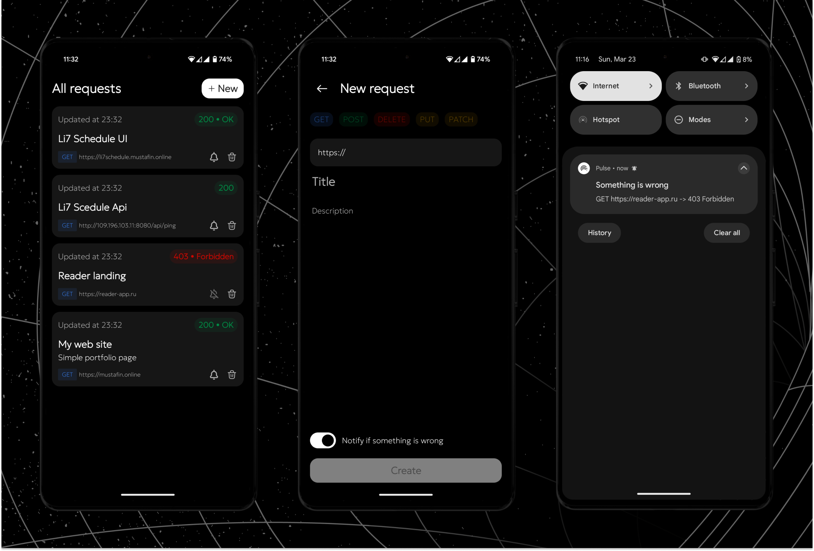

# Pulse

Pulse is an **open-source**, modern Android application that helps monitor server status and notifies users when something goes wrong. Users can create requests by specifying the type (**GET, POST, etc.**) and URL. The system periodically checks the server status and sends a notification if the response code is **400 or higher**.

Built with **Jetpack Compose**, the application provides a modern **UI** with high responsiveness. The minimum supported Android version is **8 (API 26)**.

## ⏬ Installation

There are several ways to get the **release .apk** of the Pulse application:

#### 1. Download from [GitHub Releases](https://github.com/T-e-i-l-s/Pulse/releases)

The fastest way is to download the package from [Releases](https://github.com/T-e-i-l-s/Pulse/releases), where you can find all available versions of Pulse.

#### 2. Download from the latest CI Job

This method is more flexible than the first one because it allows you to get both **release** and **debug** versions. You can also download builds from the **develop** branch or other branches to test specific features.

⚠️ **We recommend using the latest version from the `main` branch, as it is the most stable.**

#### 3. Build the project yourself

This is the most complex method but gives you full control over the build process.

To build Pulse from source:

1. Clone the repository

2. Open the project in **Android Studio**

3. Run the build process

**Enjoy using Pulse! 🚀**

## 🧑‍💻 Development & Testing

If you would like to add new functionality, please submit a **pull request (PR)** to the repository:

1. **Fork** the repository and clone it locally.

2. Create a new branch (`feature/my-new-feature`).

3. Make your changes and commit them with clear messages.

4. Ensure that the **CI job completes successfully**.

5. Open a PR to the `develop` branch, providing a detailed description of your changes. Once the changes are reviewed and tested, we will merge them into the `main` branch.

You can also **open an issue** to request new functionality or report a bug:

- Clearly describe the issue or proposed feature.

- Explain how it would improve the project.

- If applicable, provide examples or links to relevant resources.

We will review your request and provide feedback.

**Thank you for contributing to Pulse!** 🚀

## 📃 License

Pulse is provided under the [MIT License](https://github.com/T-e-i-l-s/Pulse/blob/main/LICENSE).